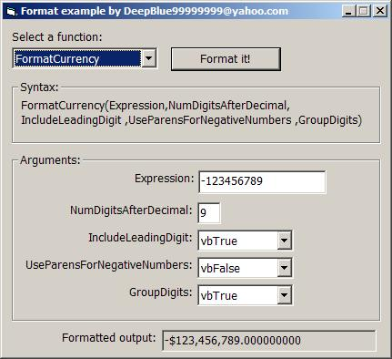



## FormatCurrencyDateTimePercentNumber

### Description

Demonstrate use of FormatCurrency, FormatNumber, FormatDateTime, FormatPercent. Good for beginners. Easy to understand.
 
### More Info
 

             |
---                |---
**Submitted On**   |2003-04-20 20:43:04
**By**             |[deepblue99999999](https://github.com/Planet-Source-Code/PSCIndex/blob/master/ByAuthor/deepblue99999999.md)
**Level**          |Beginner
**User Rating**    |4.0 (8 globes from 2 users)
**Compatibility**  |VB 6\.0
**Category**       |[Miscellaneous](https://github.com/Planet-Source-Code/PSCIndex/blob/master/ByCategory/miscellaneous__1-1.md)
**World**          |[Visual Basic](https://github.com/Planet-Source-Code/PSCIndex/blob/master/ByWorld/visual-basic.md)
**Archive File**   |[FormatCurr1577074202003\.zip](https://github.com/Planet-Source-Code/deepblue99999999-formatcurrencydatetimepercentnumber__1-44906/archive/master.zip)

